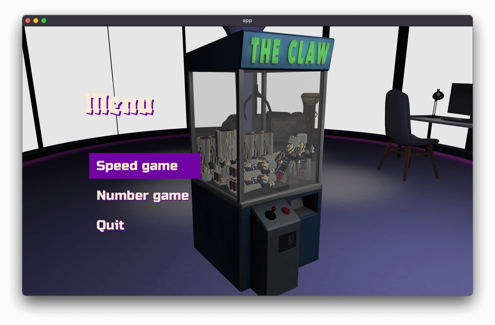

# Claw machine

Claw machine game written in [Rust](https://www.rust-lang.org/) using [Bevy](https://bevyengine.org/) engine.

I created this game to learn Rust and Bevy. The code and patterns you can see here might be far from perfect as I learned a lot in process of making and also experimented with different ways to write things to get a better feeling on how should I use one thing or another, so keep this in mind. Also the game contains some bugs because I don't want to spend more time on polishing (at least for now) as it was made just for learning purposes.

## Gamemodes

Claw machine has 2 modes: *Speed game* and *Number game*.

In *speed game* your goal is to catch a toy as fast as you can, so the result is how many seconds you spent to catch it.

*Number game* is about the number of toys you catch within the alloted time.

## Controls

`W`, `A`, `S`, `D` - move the claw and navigate in menu

`Return` - release the claw

`RMB`, `scroll wheel` (press as well) - for camera control

Also you can use `Cmd` instead of wheel press on macbook

## Credits

I want to thank:

* [Bevy](https://bevyengine.org/) engine team and community for making gamedev in rust possible today and in such a cool way.
* [dimforge](https://dimforge.com/) for [Rapier](https://rapier.rs/) - fast 2D and 3D physics engine for the Rust programming language.

* Asset creators for assets I used. Required attributions are included within a readme in corresponding folders.

## License

See [LICENSE](LICENSE)
